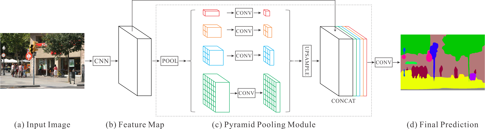

\centerline{\normalsize \textbf{Abstract}}

Recent studies have discovered clear associations between lower-grade glioma tumors and their shape features. In this study, we aim to explore the performance of various medical image segmentation models using deep learning techniques and to test the predictive outcomes for different tumor genomic sub types.\

  We used data from a previous study [@BUDA2019218], which includes preoperative imaging of 110 patients with lower-grade gliomas from five institutions participating in The Cancer Genome Atlas. From this data, three features were extracted to quantify the two-dimensional and three-dimensional characteristics of the tumors.\
  
  We found that the most effective model for automatic tumor segmentation was U-Net, with an Dice coefficient of 80%, followed by PSP-Net at 70%. In brain MRI glioma analysis, radiologist annotations are considered the gold standard. The study by [@BUDA2019218] involved two expert raters who achieved an 84% Dice coefficient, placing these algorithms within the acceptable range.
\vfill

__Keywords:__ brain segmentation; variability analysis; MRI; LGG; medical imaging
\newpage
\leftline{\large \textbf{1\hspace{1cm}Introduction}}
\vspace{0.5cm}
Medical imaging often suffers from the inter-observer variability, which refers to the difference in observations made by different observers on the same case. Our aim is to compare and test various deep learning methods on brain MRI medical imaging data that could potentially help mitigate this issue to some extent.

Deep Learning, a relatively new advancement in machine learning, has significantly improved image segmentation and analysis performance. This progress has paved the way for automating medical image segmentation, a field that relies on expert analysis.

Some deep learning applications in this regard, has become an integral part of medical imaging. Notable examples include the classification of lung nodules, breast cancer detection in mammograms, brain tumor segmentation and the prediction of Alzheimer's disease progression. Even with a brief overview, it's evident that deep learning has revolutionized the field of medical imaging.

Given the rapid advancements in this field, testing models against diverse datasets is crucial for retrospectively optimizing them for performance.

In our case, achieving a high dice coefficient value would enable the automation of tumor identification from MRI images. This would provide a fast and cost-effective alternative or support service for experts, offering a valuable second opinion.

The following sections include a description of the data, the models used and their evaluation, a comparison of model evaluations, a discussion of our findings, and the conclusion.

\newpage
\leftline{\large \textbf{2\hspace{1cm}Dataset}}
\vspace{0.5cm}
We used the dataset from the study [@BUDA2019218], which included both two-dimensional and three-dimensional data representing the characteristics of the tumors. The data was obtained from The Cancer Imaging Archive. A neuroradiology imaging researcher then manually annotated the FLAIR images by drawing the outlines of the abnormalities, resulting in the corresponding mask images.
\vspace{0.5cm}
```{r, echo=FALSE, out.width='70%', fig.cap='A sample from a three-dimensional brain FLAIR MRI (left) and the corresponding two-dimensional mask outline.', fig.align='center'}

```
\vspace{0.5cm}
\leftline{\normalsize \textbf{2.1\hspace{1cm}Preprocessing}}
\vspace{0.5cm}
No preprocessing steps are done other than skull stripping, and convolutional neural networks can automate skull stripping during preprocessing, eliminating the need for manual intervention.

\newpage
\leftline{\large \textbf{3\hspace{1cm}Methods}}
\vspace{0.5cm}
We have tried a few models that are used in medical imaging field. All of them are fully convolutional, since this is a segmentation task and we want to keep the spatial information of Low-grade gliomas.
\vspace{0.5cm}

\leftline{\normalsize \textbf{3.1\hspace{1cm}Flow}}
\vspace{0.5cm}

As depicted in Figure 2, the entire study methodology is presented. A key element of our approach was data augmentation, a well-established technique known to benefit convolutional neural network training. We implemented this by applying random rotations (range: 0-20 degrees), width/height shifts (range: 0-5 degrees), zooming (range: 0-5 degrees), and horizontal flipping (probability: 50%). Each model is trained with the same augmentation parameters.
```{r, echo=FALSE, out.width='40%', fig.cap='Flow of the entire process', fig.align='center'}

```

\newpage
\leftline{\normalsize \textbf{3.2\hspace{1cm}U-Net}}
\vspace{0.5cm}
We utilized the U-Net architecture [@DBLP:journals/corr/RonnebergerFB15] for segmentation, which is a fully convolutional neural network. U-Net comprises two main components: the contracting path (encoder) and the expansive path (decoder). These components are interconnected through skip connections. The encoder consists of 4 blocks, each containing 2 convolutional layers followed by a max pooling layer. The decoder also consists of 4 blocks, with each block containing 1 up-convolutional layer and 2 convolutional layers. Check Figure 3 for further information.

The final layer is an additional convolutional layer with a Sigmoid activation function, designed to preserve spatial information for binary segmentation. U-Net is made for utilizing strong use of data augmentation to use the available annotated samples more efficiently. We have received %80 of Dice coefficient using U-Net architecture model with cross-validation.
```{r, echo=FALSE, out.width='100%', fig.cap='U-Net inner block structure, taken from the (Ronneberger et al., 2015) study.', fig.align='center'}
knitr::include_graphics("figures/u-net-architecture.png")
```

Refer to Figure 4 for the U-Net architecture output. Each output image presented in this entire study was carefully selected to highlight specific characteristics of the model when applied to this dataset. In this instance, the level of detail was significant. We will examine this further in the comparison section.

```{r, echo=FALSE, out.width='100%', fig.cap='Prediction output of the U-Net model', fig.align='center'}

```

\vspace{0.5cm}
\leftline{\normalsize \textbf{3.3\hspace{1cm}PSP-Net}}
\vspace{0.5cm}
Our study tests the Pyramid Scene Parsing Network (PSPNet) architecture with current data, originally developed for scene parsing tasks in computer vision [@DBLP:journals/corr/ZhaoSQWJ16]. PSPNet's ability to capture multi-scale features makes it well-suited for medical image segmentation, which is the reason why we tried it in our research. Figure 5 depicts the inner structure of PSP-Net.
```{r, echo=FALSE, out.width='100%', fig.cap='PSP-Net architecture, taken from the  (Zhao et al., 2016) study.', fig.align='center'}

```
\newpage
We were able to receive 70% Dice coefficient with 60% IoU Metric with PSP-Net. Also predicted images were less detailed than the other ones, see Figure 6. 
\vspace{0.5cm}
```{r, echo=FALSE, out.width='100%', fig.cap='PSP-Net architecture, output image.', fig.align='center'}

```
\vspace{0.5cm}
\leftline{\normalsize \textbf{3.4\hspace{1cm}Fully Convolutional Network}}
\vspace{0.5cm}
Every other model we tested was also a fully convolutional network with skip connections. The one we tried here is a more compact version, featuring 3 blocks in the encoder, each containing a convolutional layer and a max pooling layer. In the decoder, it had 1 up-convolutional layer and 1 convolutional layer, all connected via skip connections.

Same augmentation parameters also used here, we only changed the model parameter in the equation to test their usability on this specific data. 

We used cross validation and received 65% Dice coefficient at best. We also got IoU Metric of 50%. It was able to portray tumor detail well, check Figure 7. Note that this sample was cherry picked from a successful prediction.

```{r, echo=FALSE, out.width='100%', fig.cap='FCN (Fully Convolutional Network) architecture, output image.', fig.align='center'}

```
\newpage
\vspace{0.5cm}
\leftline{\large \textbf{4\hspace{1cm}Results}}
\vspace{0.5cm}

After training our models, we obtained specific metrics and predictions. In the results section, we will discuss the outcomes we observed.

\vspace{0.5cm}
\leftline{\normalsize \textbf{4.1\hspace{1cm}Model Comparison and Conclusion}}
\vspace{0.5cm}
Figure 8 showcases our findings using various methods. U-Net significantly outperformed the other two methods in the primary metric, the Dice coefficient. This superior performance is attributed to U-Net being specifically designed for medical imaging, incorporating more convolutional blocks and additional skip connections.

```{r, echo=FALSE, out.width='100%', fig.cap='Final metrics.', fig.align='center'}

```

\newpage
\vspace{0.5cm}
FCN, which is essentially a lightweight version of U-Net with fewer layers and skip connections, performed the worst among the three models. This could be because FCNs are not optimized for limited data, whereas U-Net is. PSP-Net, on the other hand, found a middle ground. Its performance might be attributed to its strategy for capturing global information in the image, as it is primarily designed for scene parsing tasks. Again, PSP-Nets also not designed for limited data.

The design of PSP-Net for scene parsing is why it provides less detail in predictions compared to the other two models (see the prediction masks in the methods section). U-Net, capable of displaying more detail in prediction masks, outperformed both, since FCNs can be considered lightweight versions of U-Net.

\newpage
\center{\large \textbf{References}}
\vspace{0.5cm}
